# 209.自制Windows 7 系统镜像

Windows 7首发于2009年，正好处在传统BIOS（UEFI CLass 0）向UEFI（UEFI Class 3）的过渡时期。因此，这个特殊时期造就了Windows 7能够使用UEFI引导，但是显卡驱动却仍旧保留对传统显卡VBIOS有依赖性这样的尴尬局面（UEFI Class 2）。

这样的运行环境需要开启CSM（Compatibility Support Module，即兼容性支持模块），但常见的虚拟机VMWARE、Virtualbox、Hyper-V都没有提供支持CSM的环境，也不支持自己更换虚拟机的BIOS文件或者更换方法都比较复杂。因此，能够支持更换BIOS固件的虚拟机只剩下Qemu这一款了。

本教程就是依托Qemu来实现Windows 7的镜像制作。Qemu支持Windows、MacOS、Linux等常见平台，但是Windows平台上的Qemu加速功能效果很不理想，云固件官方提供的Windows 7企业版和旗舰版镜像也是在MacOS平台上制作成功的。

尽管Windows平台直接运行Qemu虚拟机效率不足，但是通过WSL下启动Linux环境的Qemu却能取得不俗的运行效率。因此，本教程中的Qemu虚拟机环境是在Windows操作系统中的Linux环境下运行的，有点拗口，但是这样的环境相对容易获得。

另外，Windows 7系统中的VHD Native Boot功能只能支持VHD格式镜像，因此，Windows 7的镜像必须使用VHD格式，不能使用VHDx格式。如果使用VHDx格式，那么这样的云固件镜像是无法启动成功的。

_注意：仅有Windows 7 企业版和旗舰版支持VHD启动，其他版本均不支持！_

_注意：本教程需要宿主机使用Windows 11操作系统。_

## 一、准备工作

制作Windows 7镜像的环境比较复杂，要求也比较高，变化情况也比较多，教程环境仅做关键点的指导，出现未知问题，读者可以询问AI或者搜索针对性的解决。

### 1.1 添加Hyper-V和WSL组件

Hyper-V和WSL都不是默认安装的Windows组件，需要手动安装。


打开Windows系统的“控制面板”，找到"程序"，单击，打开“Windows功能”窗口。

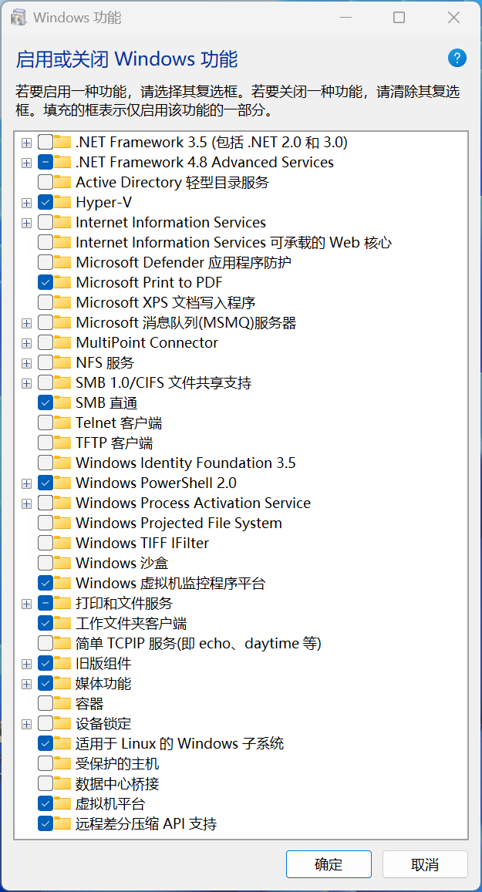

在功能中找到“Hyper-V”和“适用于Linux的Windows子系统”，选中全部功能，按“确定”，Windows系统就会自动添加这两个组件，中间可能会出现重启的要求，按照屏幕提示操作即可。

### 1.2 下载Ubuntu LTS

安装WSL后，默认没有Linux的发行版，需要自己手动安装。本教程选择安装Ubuntu 22.04 LTS版本。

打开Windows PowerShell，输入下述命令行。

```cmd
wsl --install Ubuntu-22.04
```

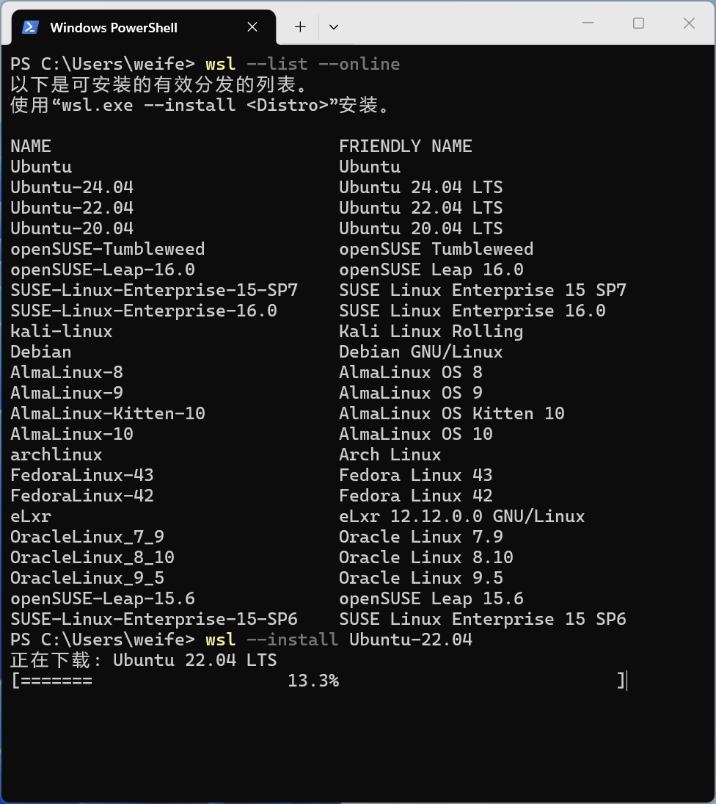

Windows就开始远程下载Ubuntu 24.04的系统镜像。

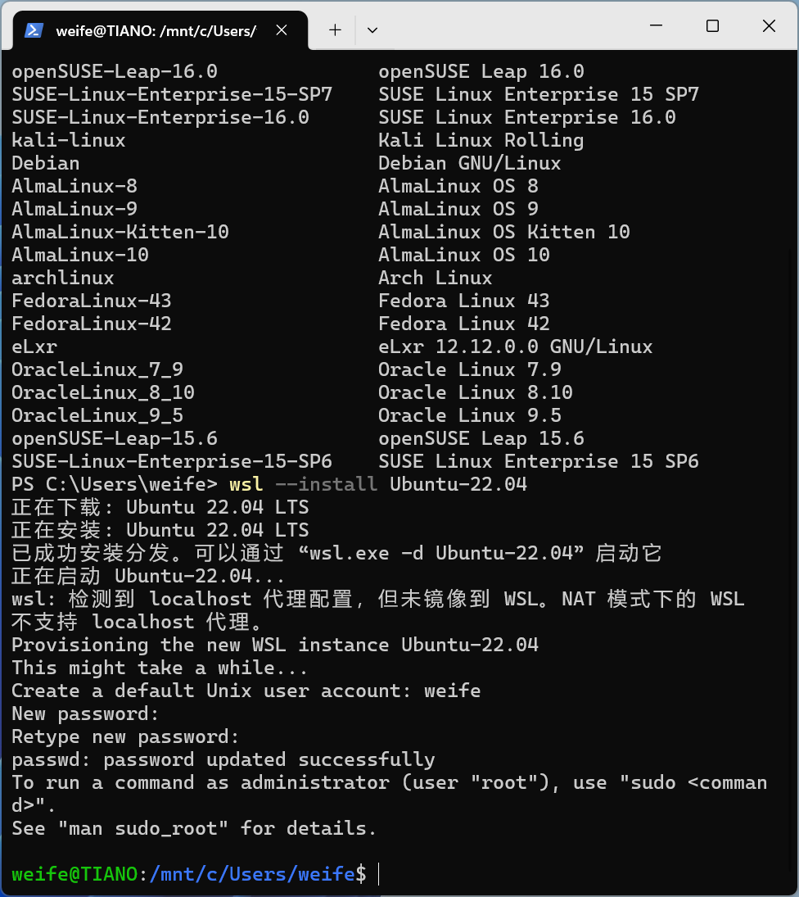

安装完成后，会提示输入用户名和密码。安装屏幕说明进行输入和设置。

_注意：这儿的账户名会使用当前Windows用户的名称，因此会出现不同情况。_


### 1.3 安装Qemu软件包

安装Windows 7需要使用qemu虚拟机。qemu软件包需要单独安装。

#### 1.3.1 启用root账户

在Linux系统下安装软件包通常需要root用户权限，也可以通过sudo来运行。由于后续绝大多数命令都需要root权限，所以切换到root用户会比较方便。

系统默认root密码未知，所以需要先设置root密码。

```bash
sudo passwd
```

执行上述命令，设置root密码，务必记住自己设置的root密码。

切换到root用户，执行下述命令。

```bash
su -
```

输入密码后，登录用户就转变为root用户了。

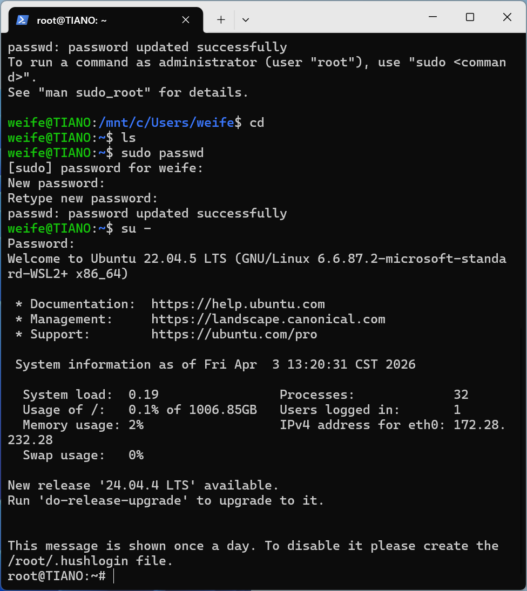

#### 1.3.2 安装软件包

使用root账户，顺序执行后面两个命令，更新软件包仓库和下载qemu软件包。

```bash
apt update
```

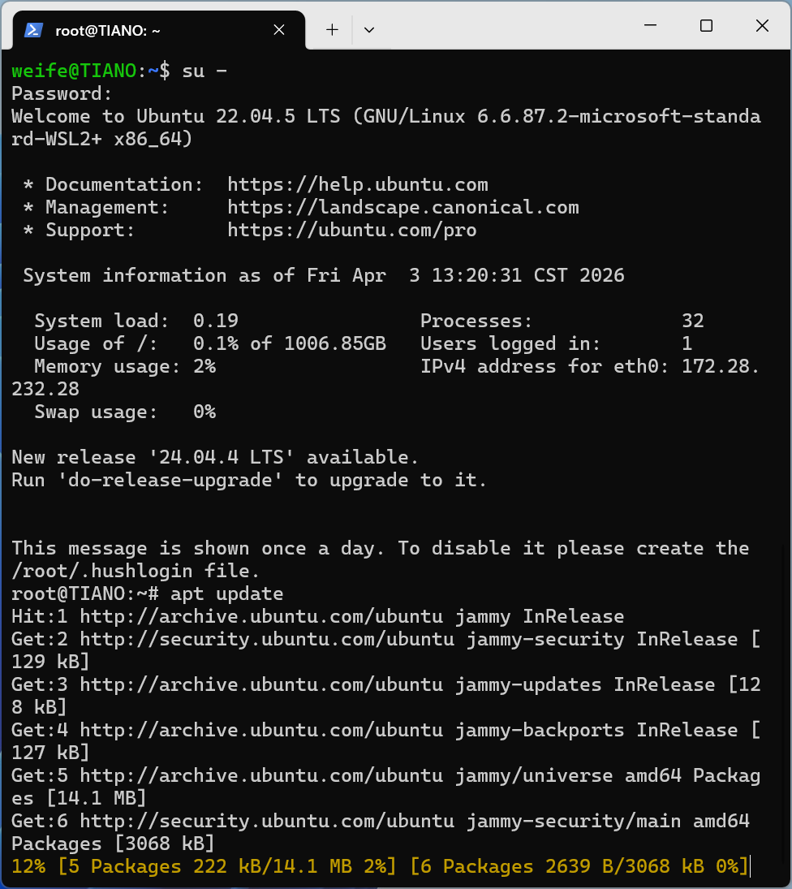

```bash
apt install qemu-system-x86
```

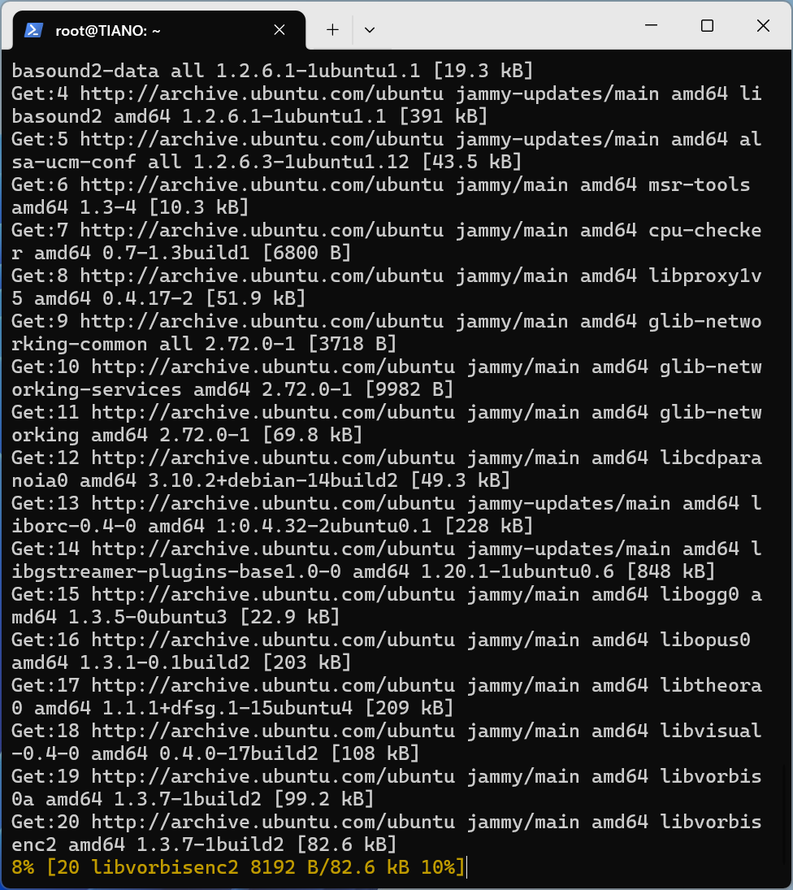

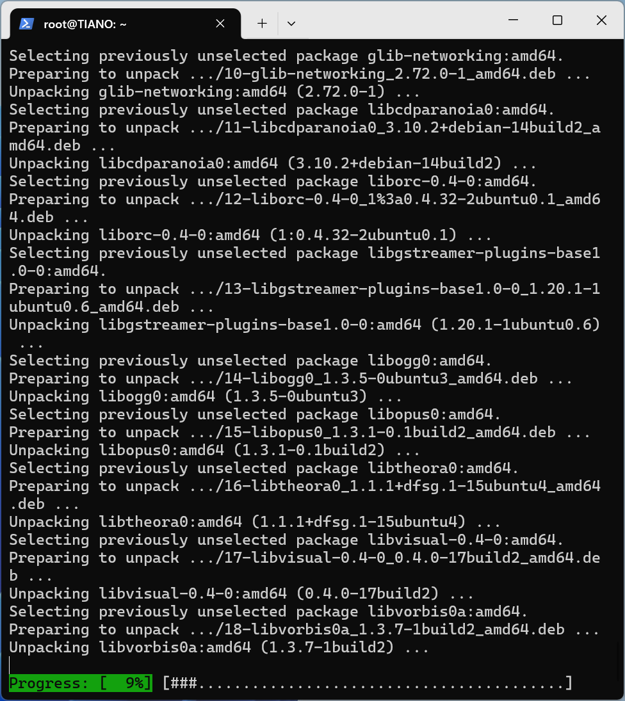


安装过程中会显示进度，进度条到头而且没有错误那么就说明安装正确。

安装成功后可以使用which命令来检查qemu-system-x86_64命令是否安装成功。

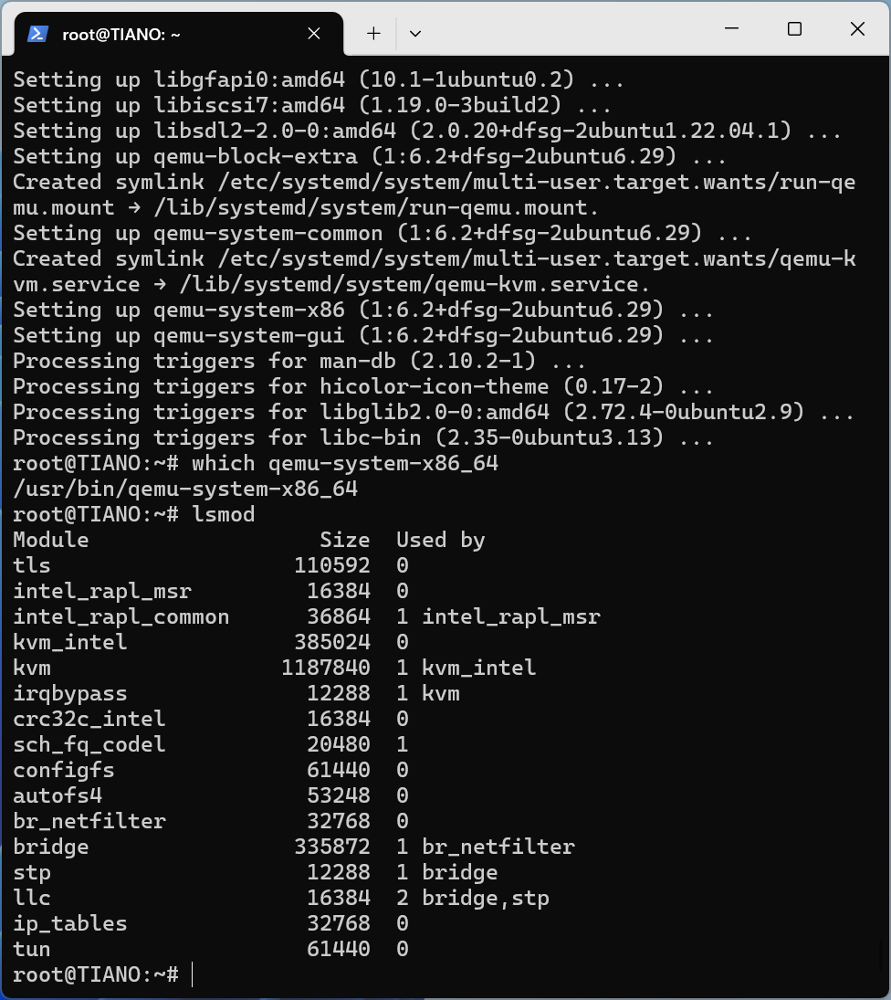

另外，Qemu加速需要内核加载kvm模块，可以通过lsmod命令查看。系统默认是加载的。如果出现缺少的情况，那么请重新安装WSL或者自行检查错误。

### 1.4 下载教程资源

“云固件教程资源”提供了教程中需要使用的工具和软件包，可以通过扫描以下图片获得网盘的共享地址。


本教程对应为“05-自制镜像/Windows-7-SP1-Ent”。

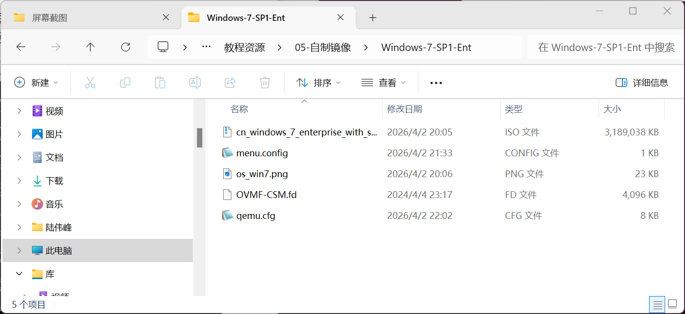

内容包括Windows 7 SP1 Ent的ISO镜像，制作镜像需要的Windows 7图标、menu.config配置文件、qemu使用的特殊固件OVMF-CSM.fd和qemu配置文件qemu.cfg，总计5个文件。

将上述文件夹复制到WSL下普通用户目录下，注意，不是root用户目录下。

复制可以通过文件资源管理器显示的WSL系统文件夹来执行，和共享文件夹使用方式相同。

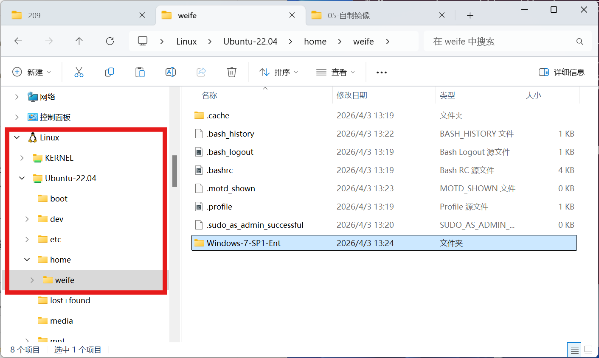

_共享二维码请使用微信扫码，不要使用其他扫码工具，包括网盘客户端的扫码工具，其中中国移动云盘为微信小程序。_

### 1.5 创建Windows 7镜像文件

本教程使用的Qemu虚拟机配置文件已经提前准备好，所以不会类似208教程中有向导帮助设置虚拟机镜像。Windows 7虚拟机使用的虚拟磁盘文件需要自己手动创建。

使用WSL的普通用户，进入前一步复制的Windows-7-SP1-Ent文件夹下，执行下述命令。

```bash
qemu-img create -f vpc Windows-7-SP1-Ent.vhd 36G
```

执行成功后，就会生成Windows-7-SP1-Ent.vhd文件。

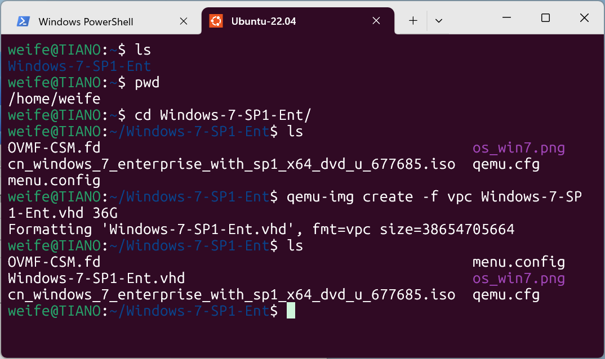

至此，全部准备工作完成。

## 二、启动Qemu虚拟机

使用WSL普通用户登录，进入Windows-7-SP1-Ent文件夹下，执行下述命令

```bash
sudo qemu-system-x86_64 -nodefaults -readconfig qemu.cfg
```

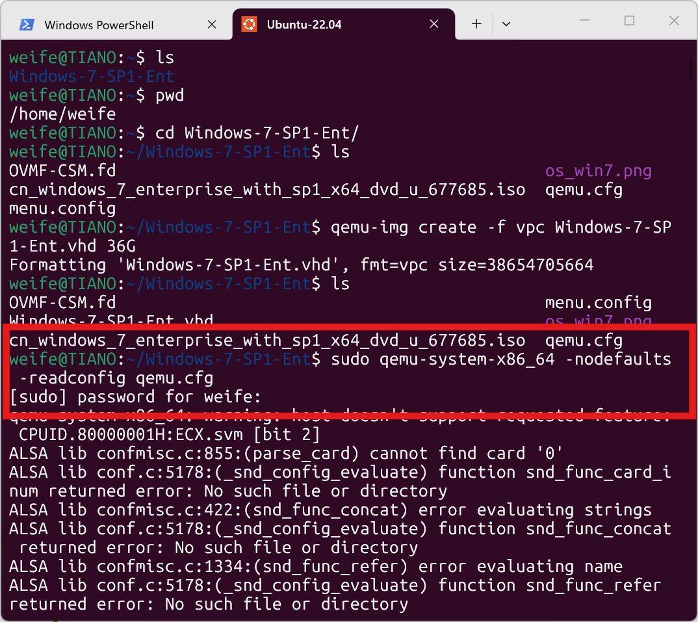

Qemu虚拟机就会自动开始运行。

_注意：Qemu虚拟机使用Ctrl+Alt+G释放虚拟机里面的键盘鼠标。_

_注意：Qemu虚拟机中的鼠标指针会有漂移，注意调整适应。_

## 三、安装Windows 7

虚拟机配置文件qemu.cfg定义了ISO形成CDROM为第二启动项，当硬盘上没有启动程序时，CDROM中的Windows 7安装程序会自主启动。

Windows原版ISO启动时都会提示“Press any key to boot from CD or DVD...”，在虚拟机窗口中央区域点击鼠标，激活虚拟机的键盘鼠标，按空格键启动Windows安装程序。

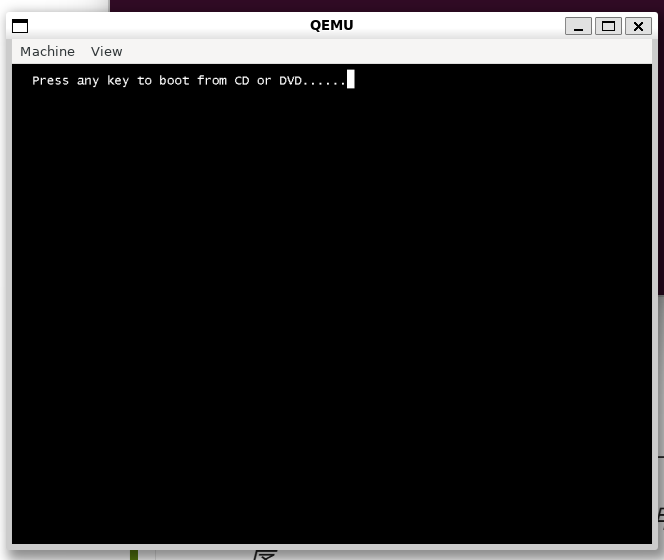

按照屏幕提示，一步一步安装Windows 7企业版。

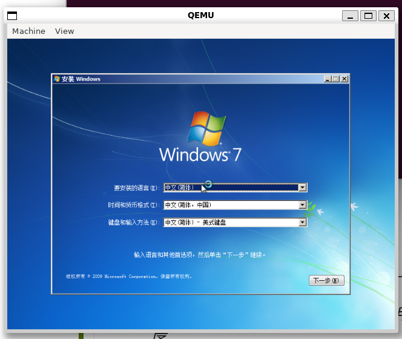

安装过程中，Windows 7在第一次重新启动时，虚拟机会出现错误，假死在类似下图这个界面。

这时，可以关闭窗口，再次执行第二步骤中的虚拟机启动命令重新启动虚拟机。

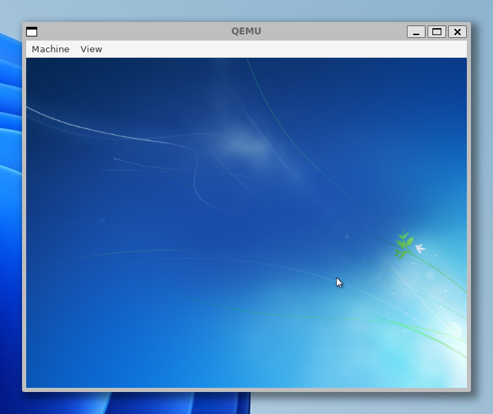

再次重启时，如提示CDROM启动，不要响应，系统会自动选择硬盘启动，安装过程会继续执行。

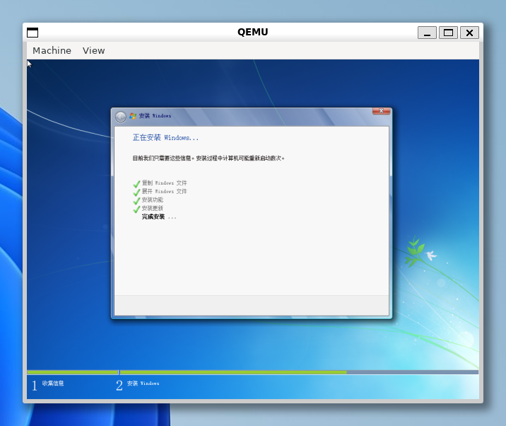

重启成功后会进入Windows 7设置。

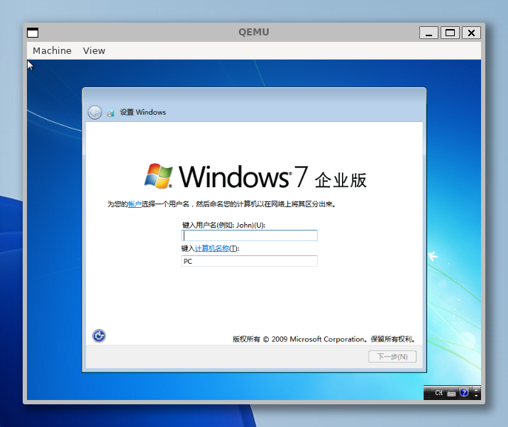

继续执行安装。

全部安装结束后，将进入Windows 7桌面，可以重启确认系统没问题。

## 四、配置Windows 7

通过第三步骤得到了Windows 7的VHD镜像文件，但这个镜像文件使用云固件启动后，默认也会自行膨胀的VHD文件的设定上限，也需要修改注册表值来防止自动扩大。

### 4.1 确认UEFI + GPT模式

由于Qemu版本较多，有些版本会出现错误，启动过程未使用制作镜像提供的专用固件，导致Windows 7安装成传统BIOS+MBR形态，可以检查安装好的Windows 7镜像磁盘是否使用GPT分区表，使用GPT分区表就没问题。

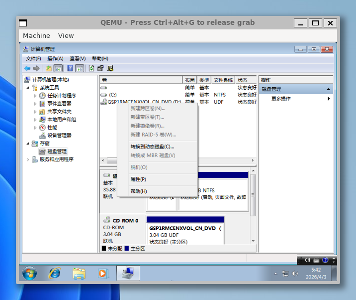

显示“转化成MBR磁盘”就说明硬盘分区表是GPT格式了。

### 4.2 修改注册表

打开“运行”，输入“regedit”，右键选择“以管理员身份运行”。

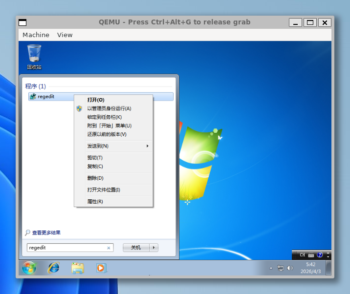

提示“用户账户控制”确认时，选择“是”。

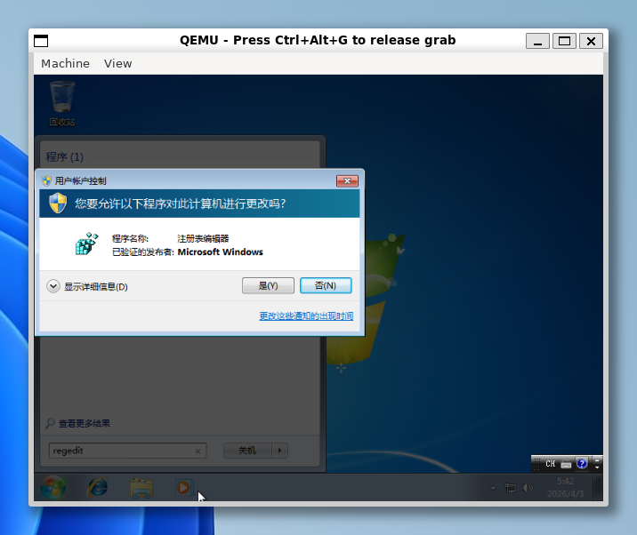

打开注册表编辑器，逐次打开“HKEY_LOCAL MACHINE\SYSTEM\CurrentControlSet\Services\fsdepends\Parameters”路径。

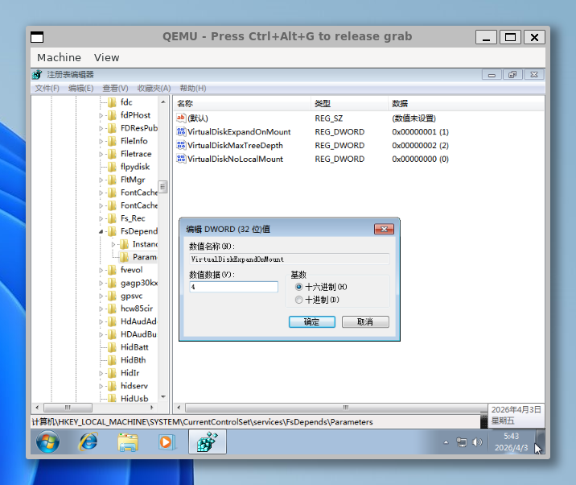

打开“VirtualDiskExpandonMount”键值，默认为“1”。

将键值修改为“4”。选择“确定”按钮，保存键值，关闭“注册表编辑器”。

Windows 7配置结束，将Windows 7从虚拟机里面关机。

Qemu窗口会自动关闭。

## 五、镜像配置

经过前面的四个步骤，我们终于得到了可用的Windows 7操作系统的VHD镜像文件。

之前教程资源里面对应的menu.config和os_win7.png已经复制过来，整个镜像文件夹就制作完成了。

安装过程中使用的qemu.cfg和OVMF_CSM.fd文件可以删除，使用云固件启动时不需要这两个文件。

将整个Windows-7-SP1-Ent文件夹从WSL系统中复制出来，就是可以使用的镜像文件夹了。

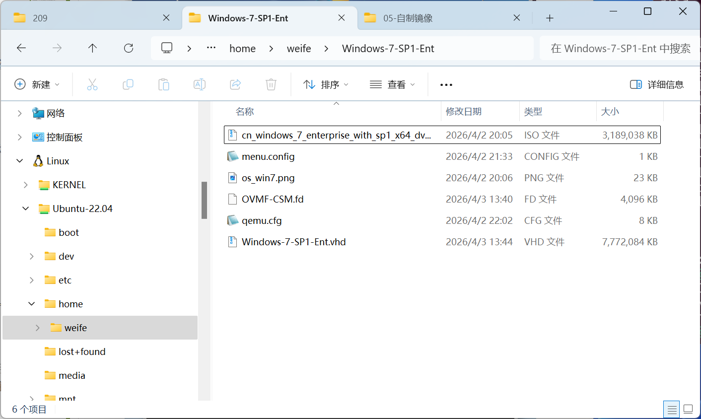

## 六、总结

Windows 7镜像的制作过程中，需要使用Linux下的Qemu虚拟机，使得整个操作过程相对复杂。

这个制作过程也可以直接在Linux系统下进行，不需要使用WSL。当然，在MacOS下也是可行的，网盘共享的Windows 7镜像最初就是在MacOS下制作成功的。
